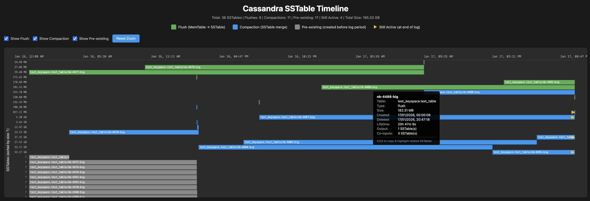

# Cassandra Tools

Tools for analyzing and visualizing Apache Cassandra operations.

## SSTable Timeline Generator

Visualize the lifecycle of Cassandra SSTables from creation to deletion.

### Features

- **Interactive Timeline Visualization** - See when SSTables are created and deleted over time
- **Color-Coded by Type** - Distinguish between flush operations (green), compactions (blue), and pre-existing files (gray)
- **Compaction Relationship Highlighting** - Click any SSTable to highlight related SSTables in the same compaction
- **Pre-existing SSTable Detection** - Automatically identifies SSTables that existed before the log period
- **Still-Active SSTable Display** - Shows SSTables that exist at the end of the log period with a marker (►)
- **Sticky Time Axis** - Time labels remain visible when scrolling vertically through many SSTables
- **Mouse Zoom** - Click and drag to select a time range and zoom in for detailed inspection
- **Keyspace.Table Labels** - Each bar displays `keyspace.table/sstable-id` for quick identification
- **Detailed Hover Information** - View SSTable size, timestamps, lifetime, and compaction relationships
- **One-Click Copy** - Click any SSTable bar to copy its name to clipboard
- **Filterable Views** - Toggle between flush, compaction, and pre-existing operations
- **Size-Based Sorting** - Y-axis sorted by file size for better pattern recognition
- **Short-lived SSTable Visibility** - Very short-lived SSTables automatically widened for visibility

### Quick Start

```bash
./sstable_timeline.sh your_cassandra_log.log output.html
open output.html
```

### Example Output



The generated HTML shows:
- **X-axis**: Timeline of events
- **Y-axis**: SSTables sorted by size (smallest to largest, "?" for unknown sizes)
- **Bars**: Each bar represents one SSTable's lifetime
  - Start = creation time (flush or compaction), or first log timestamp for pre-existing files
  - End = deletion time, or last event timestamp for still-active SSTables
  - Color = operation type:
    - **Green** = flush
    - **Blue** = compaction
    - **Gray** = pre-existing (created before log period, size unknown and shown as "?")
  - **Amber arrow marker (►)** at the end = SSTable still active at end of log period
  - Bar label shows `keyspace.table/nb-XXXX-big` for immediate identification
  - Minimum width ensures very short-lived SSTables are visible
- **Y-axis**: Keyspace.table name for each SSTable row

**Interacting with the Timeline:**
- **Hover** over any bar to see detailed information including:
  - SSTable name, keyspace.table, type, size, timestamps, and lifetime
  - Number of input/output SSTables and co-inputs in compaction relationships
- **Click** on any bar to:
  - Copy the SSTable name to your clipboard
  - Highlight all related SSTables involved in the same compaction:
    - **Click on compaction output** (blue bar): highlights all input SSTables
    - **Click on compaction input**: highlights the output AND all other inputs (co-inputs)
  - Selected SSTable shows with amber border
  - Related SSTables show with orange border
  - Other SSTables are dimmed for clarity
- **Click again** on the same bar to deselect and clear highlighting
- **Click and drag** on the timeline to select a time range and zoom in
- **Reset Zoom** button returns to the full timeline view
- Use **checkboxes** at the top to filter by flush, compaction, or pre-existing operations
- **Scroll** horizontally and vertically to navigate large timelines
  - Time axis remains sticky at the top while scrolling vertically

### Usage

```bash
./sstable_timeline.sh [--parse-only] <logfile> [output.html]
```

**Arguments:**
- `--parse-only` - (Optional) Print pipe-delimited parsed events to stdout instead of generating HTML; useful for debugging and scripting
- `logfile` - Path to Cassandra debug log file
- `output.html` - (Optional) Output HTML filename (default: input filename with `.html` extension)

**Examples:**

```bash
# Basic usage with default output
./sstable_timeline.sh debug.log

# Specify output file
./sstable_timeline.sh debug.log my_timeline.html

# Inspect parsed events (header + pipe-delimited rows)
./sstable_timeline.sh --parse-only debug.log | head

# Process a specific date's logs
grep "2026-01-16" debug.log > filtered.log
./sstable_timeline.sh filtered.log

# Extract only relevant lines recursively across multiple log files (much smaller file, faster processing)
egrep -r "(Flushed to)|(Partition merge counts were)|(Deleting sstable)" /path/to/logs/ > filtered.log
./sstable_timeline.sh filtered.log
```

### Requirements

- `bash` (4.0+)
- `gawk` (GNU AWK)
- Modern web browser (Chrome, Firefox, Safari, Edge)

**Installing gawk:**

```bash
# macOS
brew install gawk

# Ubuntu/Debian
sudo apt-get install gawk

# CentOS/RHEL
sudo yum install gawk
```

### Supported Cassandra Versions

| Version | Flush | Sharded flush (UCS) | Compaction | Deletion |
|---------|-------|---------------------|------------|----------|
| 4.1     | ✓     | N/A                 | ✓          | ✓        |
| 5.0     | ✓     | ✓                   | ✓          | ✓        |

Sizes in GiB, MiB, and KiB are all converted to MiB.

**Cassandra 4.1** — fully supported. Each flush produces one SSTable.

**Cassandra 5.0** — fully supported, including the Unified Compaction Strategy (UCS):
- Sharded flushes produce multiple SSTables per flush event — each is tracked independently
- Compaction and deletion paths may be relative (`./data/data/...`) — correctly handled
- UCS compactions with no output SSTables (`to []`) produce no compaction event; the SSTable deletions that follow will appear as pre-existing (gray) bars

Earlier versions (3.x, 4.0) are likely to work if the log format matches the patterns above, but have not been tested.

### Log Format

The script parses Cassandra debug logs for three types of events.

1. **Flush Events** (MemTable → SSTable):
```
# Cassandra 4.1
DEBUG [MemtableFlushWriter:1] 2026-01-16 00:00:08,377 - Flushed to [BigTableReader(path='/path/nb-4477-big-Data.db')] (1 sstables, 59.399MiB), biggest 59.399MiB

# Cassandra 5.0 (single SSTable)
DEBUG [MemtableFlushWriter:2] 2026-04-01 16:52:25,293 - Flushed to [BigTableReader:big(path='/path/nb-102-big-Data.db')] (1 sstables, 5.975KiB), biggest 5.975KiB

# Cassandra 5.0 UCS sharded flush (multiple SSTables per flush)
DEBUG [MemtableFlushWriter:6] 2026-04-01 17:12:43,392 - Flushed to [BigTableReader:big(path='/path/nb-2-big-Data.db'), BigTableReader:big(path='/path/nb-3-big-Data.db'), ...] (8 sstables, 911.193MiB), biggest 114.322MiB
```

2. **Compaction Events** (SSTable merges):
```
# Cassandra 4.1
INFO  [CompactionExecutor:1] 2026-01-16 03:17:04,340 - Compacted (uuid) 1 sstables to [/path/nb-4478-big,] to level=0.  13.516GiB to 13.516GiB

# Cassandra 5.0
INFO  [CompactionExecutor:1] 2026-04-01 16:52:25,843 - Compacted (uuid) 4 sstables to [./data/path/nb-105-big,] to level=0.  1.058KiB to 761B
```

3. **Deletion Events**:
```
# Cassandra 4.1
INFO  [NonPeriodicTasks:1] 2026-01-16 03:17:04,345 SSTable.java:111 - Deleting sstable: /path/nb-4472-big

# Cassandra 5.0
INFO  [NonPeriodicTasks:1] 2026-04-01 16:52:25,900 BigFormat.java:231 - Deleting sstable: /cassandra1/./data/data/path/nb-101-big
```

### Understanding the Visualization

The timeline helps identify:
- **Write patterns**: Frequency and size of flushes (use zoom to inspect bursts)
- **Compaction efficiency**: How quickly SSTables are merged
- **Compaction relationships**: Click any SSTable to see which files were merged together
  - **Click compaction output** (blue bars): Highlights all input SSTables that were merged
  - **Click compaction input**: Highlights the output SSTable AND all other inputs (co-inputs) in the same compaction
  - Helps understand merge trees, compaction behavior, and which SSTables were processed together
  - "Co-inputs" shown in tooltip indicate other inputs merged in the same compaction operation
- **SSTable lifetime**: How long files exist before compaction (zoom for precision)
- **Size distribution**: Relative sizes of SSTables over time
- **Compaction strategy behavior**: Patterns of merges and deletions
- **Pre-existing SSTables**: Files that existed before the log period (gray bars with "?" size)
  - Helps understand what was inherited from previous operations
  - Shows when old files finally get compacted away
  - Size is unknown since creation event was not captured
  - Can be highlighted as compaction inputs when clicked or when related SSTables are selected
- **Short-lived issues**: Minimum bar width ensures even millisecond-lived SSTables are visible

### Troubleshooting

**No events extracted**:
- Verify log file contains DEBUG level logs
- Check that log format matches expected patterns
- Ensure MemtableFlushWriter and CompactionExecutor messages are present

**Empty timeline**:
- SSTables need at least a creation (flush/compaction) or deletion event to appear
- SSTables still active at the end of the log are shown with an amber (►) marker
- Pre-existing SSTables (deleted but not created in log) appear as gray bars

**No compaction events in Cassandra 5.0 UCS logs**:
- UCS compactions that produce no output SSTables (`to []`) are skipped — this is expected
- Use `--parse-only` to verify which events were extracted

**Performance with large logs**:
- Consider filtering logs by date range first
- Use `grep` to extract relevant time periods

## License

Apache License 2.0
